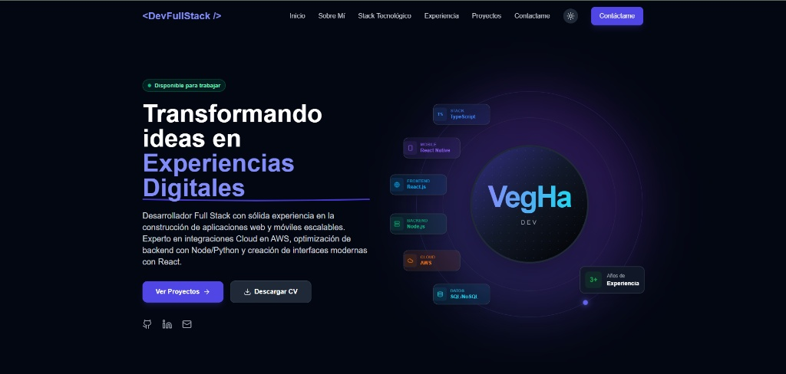
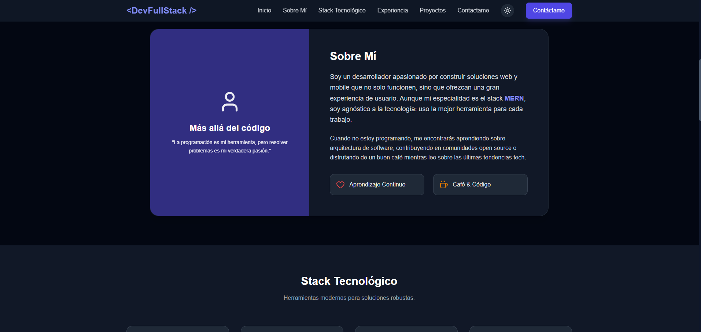
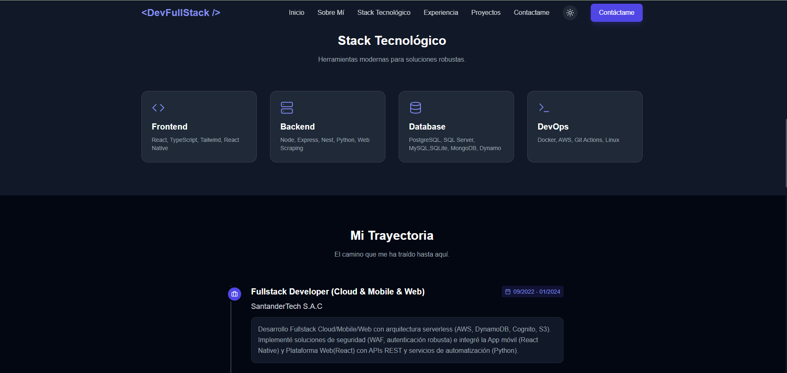
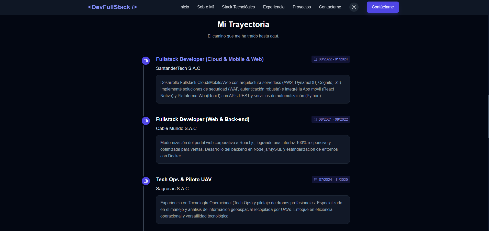
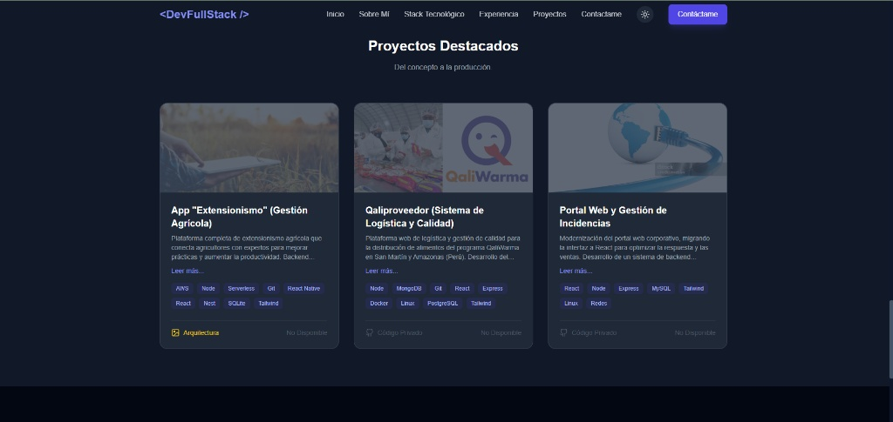
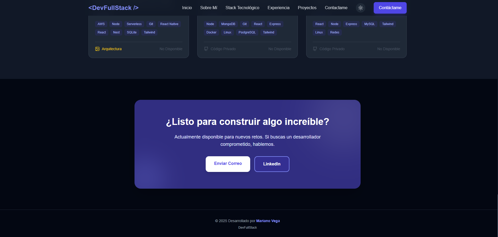

<div align="center">
  <h1 style="margin-bottom: 0;">Portafolio Profesional - Mariano Vega</h1>
  <h3 style="margin-top:0">&lt;DevFullStack /&gt;</h3>
  
  <p>
    
    
    
    
  </p>
</div>

> **"Transformando ideas en Experiencias Digitales"**
>
> Un portafolio moderno, agnóstico a la tecnología y altamente escalable, diseñado para mostrar mi trayectoria como Full Stack Developer.

## 📸 Galería del Proyecto

Un vistazo a las secciones principales de la aplicación en modo oscuro.

### 🏠 Inicio & Sobre Mí o de alguein mas

<p align="center">
  
  
</p>

### 🛠️ Stack Tecnológico & Experiencia

<p align="center">
  
  
</p>

### 🚀 Proyectos Destacados

<div align="center">
  
  
</div>

---

## ⚡ Stack Tecnológico (Cutting Edge)

Este proyecto utiliza versiones de vanguardia para asegurar el máximo rendimiento y tipado estricto.

| Área                  | Tecnologías & Versiones                         |
| --------------------- | ----------------------------------------------- |
| **Frontend Core**     | `React 19` • `Vite 7.2.4`                       |
| **Lenguaje**          | `TypeScript 5.9.3` (Strict Mode)                |
| **Estilos**           | `Tailwind CSS 3.4.17` (Dark Mode Native)        |
| **Runtime**           | `Node.js 24.11`                                 |
| **Calidad de Código** | `ESLint 9.39.1`                                 |
| **Arquitectura**      | `Data-Driven Components` • `Clean Architecture` |

---

## 📂 Características de Ingeniería

Más allá de la interfaz visual, el código está estructurado profesionalmente:

- **🧩 Arquitectura Modular:** Separación clara entre `views`, `components` y `layouts`.
- **🧠 Data-Driven UI:** El contenido (Experiencia en Santander/Cable Mundo, Proyectos) se inyecta desde archivos TypeScript en `src/data/`, facilitando actualizaciones sin tocar el JSX.
- **🛡️ Tipado Fuerte:** Uso extensivo de Interfaces (`StackItem`, `Project`, `Experience`) para evitar errores en tiempo de ejecución.
- **🎨 Diseño Atómico:** Componentes reutilizables como `<Card />` que se adaptan a diferentes contextos (Proyectos vs Experiencia).

---

## 🛠️ Instalación y Despliegue

Sigue estos pasos para levantar el entorno localmente:

1.  **Clonar el repositorio**

    ```bash
    git clone https://github.com/mvegha/mi-portafolio.git
    cd mi-portafolio
    ```

2.  **Instalar dependencias (NPM)**

    ```bash
    npm install
    ```

3.  **Ejecutar en desarrollo**
    ```bash
    npm run dev
    ```
    📍 Abre `http://localhost:5173` en tu navegador.

---

## 📬 Contacto & Redes

¿Buscas un desarrollador comprometido para construir algo increíble?

- **Autor:** Mariano Vega (VegHa Dev)
- **Perfil:** Full Stack Developer (Cloud, Mobile & Web)
- **Estado:** 🟢 Disponible para trabajar

[](https://www.linkedin.com/in/mvegha/)
[](https://github.com/mvegha)

---

<p align="center">
    © 2025 Desarrollado por <b>Mariano Vega</b> • DevFullStack
</p>
